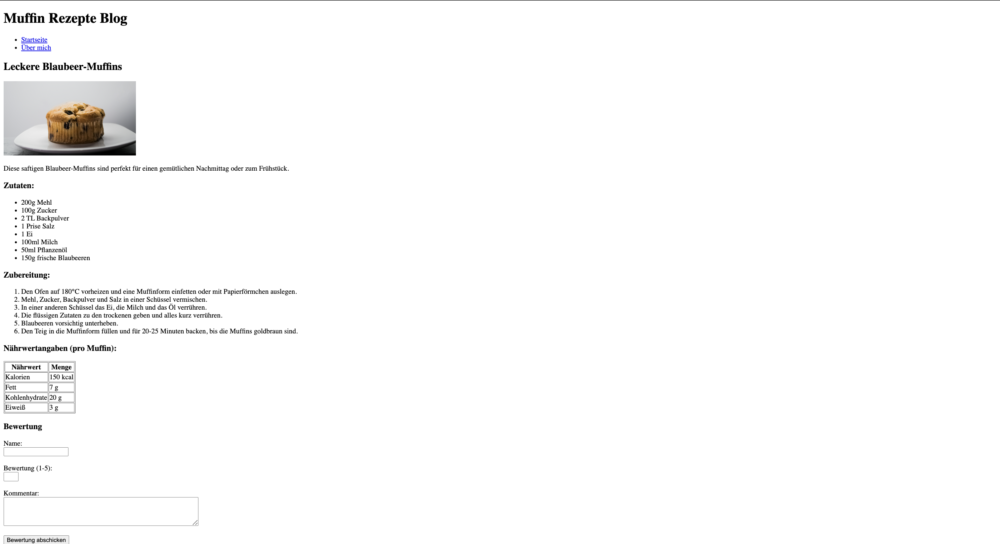
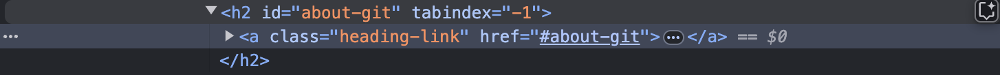
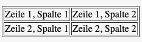
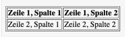

<style scoped>
section { justify-content: center; }
</style>
# Web Engineering I - HTML 
Elisabeth Kletsko – DHBW Mosbach WiSe 2024 

---
<style>

section { justify-content: start; }
section::after {
  content: attr(data-marpit-pagination) '/' attr(data-marpit-pagination-total);
}
</style>

<!-- # Quellen dieser Vorlesung
- https://www.w3schools.com/html/default.asp
- https://developer.mozilla.org/en-US/docs/Learn/HTML -->
## Ziele dieser Vorlesung
- Die Idee hinter HTML verstehen  
- Gängige Tags kennenlernen und diese anwenden 
- Eine einfache Webseite erstellen
---
## Ziele dieser Vorlesung
 

---
## Was ist HTML (Hypertext Markup Language)?

> 📖 **Hypertext** (dt. „Übertext“)
>    Text mit Querverweisen zur Bildung einer netzartigen Struktur

> 📖 **Markup Language** (dt. „Auszeichnungsprache“)
> Darstellung von Inhalt eines Dokumentes erweitert um die Information, wie der Text _strukturiert_ sein soll (bspw. überschriften, Absätze, Verweise ...)

> 📖 **HTML**
> Eine Auszeichnungssprache, mit welcher die Struktur von Web-Inhalten definiert werden kann. HTML Dokumente bestehen aus einer *Sequenz von HTML-Elementen*, welche Abschnitte definieren – e.g. "Das ist eine Überschrift", „Das ist ein Link“, „Das ist ein Paragraph“ etc.
---
## Warum HTML?
**Recap**
> 📖 **WWW**
> Ein System von untereinander verlinkten, Hypertext-Dokumenten.

- HTML *strukturiert* die Inhalte eines Hypertext-Dokuments / Web-Frontends
- Legt primär *kein* Design einer Website fest (das ist CSS!) oder Verhalten eines Elements (bspw. was passiert, wenn ich einen Knopf drücke) [MDN Web Docs](https://developer.mozilla.org/en-US/docs/Learn/Getting_started_with_the_web/HTML_basics)
---
## Was macht der Browser mit HTML? 
- Kurzum: Der Browser nimmt den HTML-„Text“ entgegen und erstellt einen dazugehörigen DOM-(Baum)
- Das DOM wiederrum stellt APIs bereit, um den Inhalt einer Website zu manipulieren (bspw. mit JavaScript)

> 📖 **DOM**
> Das Document Object Model (DOM) ist die Datenrepräsentation der Objekte, die die Struktur und den Inhalt eines Dokuments im Web bilden [MDN Web Docs](https://developer.mozilla.org/de/docs/Web/API/Document_Object_Model/Introduction)

---
## DOM


---
## HTML Syntax – Elemente
 
1. **Opening Tag** – Wo die Veränderung an der Struktur stattfinden soll
2. **Inhalt** – Text
3. **Closing Tag** – Wo die Wirkung aufhören soll 
➡️ [W3 Schools HTML Taglist](https://www.w3schools.com/tags/default.asp)
---
## HTML Elemente – Block vs Inline
- **Block** Elemente werden so breit, wie es geht
  - Nachfolgende Elemente befinden sich in der nächsten Zeile 
  - Bspw. `ul`, `p`, `div` 
- **Inline** Elemente sind nur so breit, wie ihr Inhalt 
  - Erzeugen keine neue Zeile
  - Bspw. `a`, `strong`, `em` 
---
## HTML Syntax – Kommentare
- Kommentare werden in HTML mit einem `<!-- -->` umklammert 

```html
<p>I'm not inside a comment</p>
<!-- <p>I am!</p> -->
```
---

## HTML Syntax – Attribute 
- Tags können mit dedizierten Attributen (Eigenschaften) versehen werden [W3 Schools](https://www.w3schools.com/tags/ref_attributes.asp)
  - Bspw das `onclick` Attribut erlaubt die Zuweisung einer Funktion, die bei Interaktion mit dem Element ausgeführt werden soll [W3 Schools](https://www.w3schools.com/tags/att_onclick.asp)
```html
<!-- <tagname attribut1="value1" attribut2="value2" ...> ... </tagname> -->
<p lang="fr"> ... </p>
```
- Für manche Attribute muss kein Wert angegeben werden (bspw. `disabled`)
```html
<button disabled>Nicht klickbar</button>

```
- **Globale** Attribute können jedem Tag hinzugefügt werden, siehe [W3 Schools](https://www.w3schools.com/tags/ref_standardattributes.asp)

---
## HTML Syntax – Leere HTML Elemente (Eng: Void Elements)
- Es gibt HTML Elemente, welche keinen Inhalt haben.
  - Bspw. `<br>` (neue Zeile) oder `<hr>` (horizontale Linie ).
  - Diese haben dann auch kein schließendes Tag! 
<!-- - _Kennst du noch ein weiteres, leeres Element?_ -->
<!-- 
-->
---
## HTML Syntax – Schachtelung (eng. „Nesting“)
- Nicht leere HTML Elemente können _geschachtelt_ werden
  - Bspw. `<p>My cat is <strong>very</strong> grumpy.</p>`
- Ein Tag, das in einem anderen Tag geöffnet wird muss geschlossen werden, bevor das erste Tag geschlossen werden kann.
- **Richtig**: `<p>My cat is <strong>very grumpy.</strong></p>`
- **Falsch**: `<p>My cat is <strong>very grumpy.</p></strong>`
---
## HTML Dokumente Grundstruktur
- Die minimale Struktur eines jeden HTML Dokuments besteht aus den folgenden Elementen:
```html
<!DOCTYPE html> 
<html>
    <head>
      <title>HTML – Hello World!</title>
    </head>
    <body>
    </body>
</html>
```
---

## #Lab 1 – HTML ausprobieren 

1. Öffne VSCode und starte ggf. die Liveserver Extension  
2. Erstelle eine `index.html` und füge den unterstehenden Code ein
3. Verändere den Text in dem `<title>`-Tag
4. Öffne den Browser mit dem dazugehörigen Port
<!-- Welche Auswirkung hat das title Attribut? -->

```html
<!DOCTYPE html> 
<html>
    <head>
        <meta charset="UTF-8">
        <title>Der Titel Deiner Website</title>
    </head>
    <body>
    </body>
</html>
```
<!-- 💡 HTML erzeugen
 Um die HTML Grundstruktur zu erzeugen, tippe einfach ! + <Enter> in VSCode -->
---
## HTML Dokumente – Grundstruktur
- `<!DOCTYPE html>` Deklaration sagt aus, dass das ein HTML5 Dokument ist
- `<html>` das Stammelement _jeder_ HTML Seite
- `<head>` Element enthält zusätzliche Informationen über die HTML Seite – bspw. den Titel (`<title>`) oder das Charset (dt. „Zeichensatz“)
  - Die Informationen befinen sich in den Tags `<link>`, `<style>`, `<script>`, `<meta>`, `<title>`
- `<body>` Element enthält den **sichtbaren** Teil einer HTML-Seite 
---
## Metadaten 
> 📖 **Metadaten**
> Metadaten sind strukturierte Daten, die Informationen über Merkmale anderer Daten enthalten

- Meta Daten werden über das `<meta>` Tag vermittelt. Je nach Wert mit unterschiedlichen Attributen (`name`, `charset`) [MDN Web Docs `<meta>` Tag](https://developer.mozilla.org/en-US/docs/Learn/HTML/Introduction_to_HTML/The_head_metadata_in_HTML#metadata_the_meta_element) 

---
## Relevante Meta tags 
- `author` Gibt den Autor der Seite an
- `description` Beschreibt den Inhalt der Seite
- `keywords` Eine Liste von Schlüsselwörtern, die den Inhalt der Seite beschreiben (relevant für SEO)
- `viewport` Steuert das Layout auf mobilen Browsern
- Weitere unter [W3 Schools](https://www.w3schools.com/tags/tag_meta.asp)
```html
<head>
 <meta charset="UTF-8">
 <meta name="description" content="A page about Anna Wilson">
 <meta name="author" content="Anna Wilson">
</head>
```
---
## #Lab 2 – Debugging von HTML

1. Gehe auf die Website [https://www.mosbach.dhbw.de/](https://www.mosbach.dhbw.de/) 
2. Öffne den Inspektor (Rechtsklick → „Untersuchen“ / „Inspect“)

_Welche Meta Daten liegen vor?_

---
## Semantisches HTML
<!-- Es ist nicht egal, was für HTML man nutzt -->
<!-- Dauerbrenner: h-Tags mischen --->
> 📖 **Semantik**
> Bedeutung, Inhalt (eines Wortes, Satzes oder Textes)

- Einige HTML Tags haben eine Semantik / Bedeutung 
-  Die richtige Nutzung von Tags ist für visuell-eingeschränkte Personen wichtig. 
    - Die Ausgabe des Screen Readers basiert auf der Struktur und wird ggf. anders betont.
---
## Semantisches HTML – Beispiel


<!-- ## HTML Dokumente strukturieren mit Elementen
_Warum brauchen wir überhaupt Struktur?_
- [Quelle](https://developer.mozilla.org/en-US/docs/Learn/HTML/Introduction_to_HTML/HTML_text_fundamentals) -->
---
## Mit HTML strukturieren – Texte  

**Absätze** (eng. „Paragraph”) – `<p></p>` 
- Beginnt mit einer neuen Zeile, danach folgt ein Zeilenumbruch.
- Standard: Abstand vor und nach dem Absatz.

**Überschriften** (eng. „Header”) - `<h1></h1> ... <h6></h6>`
- Beginnt jeweils mit einer neuen Zeile, danach folgt ein Zeilenumbruch.
- `<h1>` ist die höchstrangige Überschrift, `<h6>` die niedrigstrangige.
- Von `<h1>` nach `<h2>` kleiner werdende Schrift und kleinere Abstände
<!-- Analogie zu einem Textbuch -->
---
<style scoped>
  table {font-size: 0.85rem;}
  </style>
## Mit HTML strukturieren – Allgemeine Website-„Container“
<!-- - Eine Website kann bspw. einen Header, Content, Footer etc. haben. 
- Hierfür hat man ab HTML 5 dedizierte Tags eingeführt. -->

| Tag         | Semantik |
|:-------------|:----------|
| `<header>`  | Enthält Einführungsinhalte oder Navigationslinks |
| `<nav>`     | Definiert einen Bereich für Navigationslinks |
| `<main>`    | Hauptinhalt der Seite, einzigartig und zentral |
| `<article>` | Unabhängiger, eigenständiger Inhalt wie ein Blogpost |
| `<section>` | Thematisch zusammenhängender Bereich der Seite |
| `<div>`     | Allgemeines Container-Element ohne spezifische Semantik |
| `<aside>`   | Inhalt, der indirekt mit dem Hauptinhalt verbunden ist, wie Seitenleisten |

- Weitere Tags [hier](https://developer.mozilla.org/en-US/docs/Learn/HTML/Introduction_to_HTML/Document_and_website_structure)
---
## #Lab 3 Mit HTML Texte strukturieren 
- Erstelle in dem zuvor erstellten HTML Dokument folgende Überschriften für ein Blaubeermuffin-Rezepte-Blog
```html
    * Muffin Rezepte Blog
    * Leckere Blaubeer-Muffins
    * Zutaten
    * Zubereitung
    * Nährwertangaben (pro Muffin):
    * Bewertung
```
- Füge noch einen Text mit einem passenden Tag unter der Überschrift „Leckere Blaubeer-Muffins“ hinzu
  - `Diese saftigen Blaubeer-Muffins sind perfekt für einen gemütlichen Nachmittag oder zum Frühstück.`
- In welche „Container“ können wir so eine Website unterteilen?
---
## #Lab 3 Mit HTML Texte strukturieren – Lösung
```html
<!DOCTYPE html>
<html lang="de">

<head>
    <meta charset="UTF-8">
    <meta name="viewport" content="width=device-width, initial-scale=1.0">
    <meta name="description" content="Leckeres Muffin-Rezept für einen Blog mit Nährwertangaben und Bewertung.">
    <title>Muffin Rezept Blog</title>
</head>

<body>
    <header>
    <h1>Muffin Rezepte Blog</h1>
    </header>
    <main>
    <section>
    <h2>Leckere Blaubeer-Muffins</h2>
        <p>Diese saftigen Blaubeer-Muffins sind perfekt für einen gemütlichen Nachmittag oder zum Frühstück.</p>
        <h3>Zutaten:</h3>
        <h3>Zubereitung:</h3>
        <h3>Nährwertangaben (pro Muffin):</h3>
    </section>
    <section>
      <h3>Bewertung</h3>
    </section>
  </main>
</body>
</html>
```
---
## HTML Listen
- Listen kommen in HTML in zwei Formen vor: _geordnet_ (`<ol>`) und _ungeordnet_ (`<ul>`)
- Die Kind-Elemente sind dabei stets `<li>`
> 💡 Es müssen nicht immer zwingend reine Texte als Listen-Elemente vorliegen. Dies können auch Bilder oder Hyperlinks sein
---
## HTML Listen – Beispiele
```html 
<ul> <!-- unordered list  -->
    <li>200g Mehl</li>
    <li>100g Zucker</li>
    <li>2 TL Backpulver</li>
</ul>
```
```html 
<ol>  <!-- ordered list with nesting-->
    <li>Alle Zutaten bereitlegen</li>
    <li>Milch und Eier vermischen</li>
    <li>...</li>
    <li>Weitere Elemente 
      <ul>
        <li>Verschachtelte Liste</li>
      </ul>
    </li>
</ol>
```
---
## HTML Listen – Design ändern
- Das Listen„design“ in HTML kann verändert werden
- Mit dem `start` Attribut können andere Startewerte bei `ol`vergeben werden
  - `<ol start="5">...</ol>`
- Das `reversed` Attribut kehrt die Reihenfolge der Liste um
  - `<ol reversed>...</ol>`
- Mit `type` können bei `<ol>` bspw. römische Zahlen oder Buchstaben verwendet werden.

---
## #Lab 4 – Listen erstellen
- Erstelle in der `index.html` eine geordnete, nummerierte Liste unter der Überschrift „Zubereitung“ mit den Schritten für die Zubereitung.
- Zusatz: Probiere mit dem `type` Attribut rum [W3 Schools Referenz](https://www.w3schools.com/tags/att_ol_type.asp)
Die Schritte sind: 
```html
1.Den Ofen auf 180°C vorheizen und eine Muffinform einfetten oder mit Papierförmchen auslegen.
2.Mehl, Zucker, Backpulver und Salz in einer Schüssel vermischen
3.In einer anderen Schüssel das Ei, die Milch und das Öl verrühren.
4.Die flüssigen Zutaten zu den trockenen geben und alles kurz verrühren.
5.Blaubeeren vorsichtig unterheben
6.Den Teig in die Muffinform füllen und für 20-25 Minuten backen, bis die Muffins goldbraun sind.
``` 
---
## #Lab 4 – Lösung
```html
        <ol>
            <li>Den Ofen auf 180°C vorheizen und eine Muffinform einfetten oder mit Papierförmchen auslegen.</li>
            <li>Mehl, Zucker, Backpulver und Salz in einer Schüssel vermischen.</li>
            <li>In einer anderen Schüssel das Ei, die Milch und das Öl verrühren.</li>
            <li>Die flüssigen Zutaten zu den trockenen geben und alles kurz verrühren.</li>
            <li>Blaubeeren vorsichtig unterheben.</li>
            <li>Den Teig in die Muffinform füllen und für 20-25 Minuten backen, bis die Muffins goldbraun sind.</li>
        </ol>
```
---
## HTML Elemente –Hyperlinks 
> 📖 **Hyperlink** (Umgangssprachlich „Link“)
> Ein Hyperlink erlaubt die Verlinkung von Dokumenten zu anderen Dokumenten, Ressourcen oder sogar spezifischen Abschnitten eines Dokuments. Es ist ein Verweis mit automatischer Verweisauflösung. Besteht aus einem _sichtbaren_ Teil (die Beschreibung) und das m´(meist) unsichtbare Verweisziel.

- **Syntax**: Öffnendes `<a>`-Tag mit einem `href` und ggf. anderen Attributen
- Hyperlinks sind auch um Blockelemente erlaubt (bspw. ein `div`)
```html
<p>
  I'm creating a link to
  <a href="https://www.mozilla.org/en-US/" target="_blank">the Mozilla homepage</a>.
</p>
```
---
## Hyperlinks – Auf der selben Seite verlinken
- Die `#` erlaubt das Verlinken auf ein bestimmtes HTML Element, welches mit einem `id` Attribut versehen ist
- Bspw. [https://docs.github.com/en/get-started/start-your-journey/about-github-and-git#about-git](https://docs.github.com/en/get-started/start-your-journey/about-github-and-git#about-git) verlinkt direkt zum HTML Element, welches das Attribut `id="about-git"` hat.



---
<style scoped>
  table {font-size: 0.5rem;}
  </style>
## Attribute von Hyperlinks

| **Attribut**     | **Beschreibung**                                                                                              | **Beispielwert**              |
|-------------------|--------------------------------------------------------------------------------------------------------------|-------------------------------|
| `href`           | Gibt die URL des Links an.                                                                                   | `https://example.com`         |
| `target`         | Bestimmt, wo der Link geöffnet wird: `_self` (Standard), `_blank`, `_parent`, `_top`.                        | `_blank`                      |
| `rel`            | Definiert die Beziehung zwischen der verlinkten Seite und der aktuellen Seite. Häufig verwendet: `nofollow`. | `noopener noreferrer`         |
| `type`           | Gibt den MIME-Typ des verlinkten Inhalts an.                                                                 | `text/html`                   |
| `download`       | Ermöglicht das Herunterladen einer Datei anstelle des Öffnens.                                               | `filename.txt`                |
| `title`          | Zeigt einen Tooltip mit einer Beschreibung, wenn die Maus über den Link bewegt wird.                         | `Mehr Informationen`          |
| `hreflang`       | Gibt die Sprache des verlinkten Inhalts an.                                                                  | `en`, `de`                    |
| `referrerpolicy` | Steuert, welche Referrer-Informationen beim Link-Aufruf gesendet werden.                                     | `no-referrer`, `origin`       |
| `ping`           | Eine Liste von URLs, die bei einem Klick auf den Link durch einen Ping kontaktiert werden.                   | `https://tracking.example.com`|

➡️ Meistens nur `href` und `target` wichtig 

---
## #Lab 5 HTML Hyperlinks 
- Erstelle in der `index.html` an passender Stelle ein
 `<nav>` Element mithilef einer ungeordneten Liste (`<ul>`)

- Füge 2 Hyperlinks ein:
  1. Einmal zur Startseite (`index.html`). Wenn man über den Link hovered, soll ein Tooltip mit `Hier gelangst Du zur Startseite` erscheinen
  2. Einmal zu einer beliebigen externen Seite (bspw. Google). Dabei soll sich der Link in einem neuen Tab öffnen.
- Zusatz: Erstelle eine weitere `.html` Seite und verlinke diese (bspw. „Über mich“)
---
## #Lab 5 Lösung
```html
        <nav>
            <ul>
                <li><a href="index.html" title="Hier gelangst Du zur Startseite">Startseite</a></li>
                <li><a href="https://www.google.de/" target="_blank">Externe Webseiten</a></li>
            </ul>
        </nav>
``` 
---
## HTML Elemente – Multimedia 
> 📖 **Multimedia**
> Multimedia bezieht sich auf die Verwendung von verschiedenen Medienformen, wie Text, Audio, Bilder, Animationen, Video und interaktiven Inhalten, um Informationen darzustellen oder zu kommunizieren. 
---
## HTML Elemente – Bilder einfügen 
- Zum Bilder einfügen verwendet man in HTML das `` Tag (Abkürzung für _image_) mit Attributen
``
- Das `alt` („Alternativer Text“) Attribut ist wichtig, sollte das Bild mal nicht laden. Der enthaltene Text wird angezeigt, 
wenn die Grafik (noch) nicht dargestellt wird. Darüber hinaus liest der Screen Reader den `alt` Text.
- Sollte die Grafik nur dekorative Zwecke erfüllen, kann ein `alt=""` geschrieben werden – der Screen Reader überspringt die Grafik dann.

---
## #Lab 6 - Bilder einfügen
- Suche ein beliebiges Bild im Internet und füge es in dein erstelltes HTML Dokument ein unter der Überschrift „Leckere Blaubeermuffins“
---
## #Lab 6 – Lösung

```html
    
```
---
## Multimedia – Sonstige Typen 
- Audio: `<audio>`-Tag
- Video: `<video>`-Tag

```html
<audio controls>
  <source src="audio.mp3" type="audio/mpeg">
  Your browser does not support the audio element.
</audio>

<video width="320" height="240" controls>
  <source src="movie.mp4" type="video/mp4">
  Your browser does not support the video tag.
</video>

```
---
<!-- Früher wurden (unsichtbare) Tabellen im Web verwendet, um zu Layoute -->
<!-- Mehr Quältext als Quelltext -->
## HTML Elemente – Tabellen
- Eine einfache Tabelle besteht aus drei Tags

| Tag    | Beschreibung |
| -------- | ------- |
| `<table>`  | Beginn und Ende einer Tabelle werden mit `<table>` und `</table>` markiert  |
| `<tr>`    | Umklammert `<td>` und bildet eine Zeile (Table Row) |
| `<td>` | Beginn und Ende einer Zelle, `<td>` (Table Data)|


---
## HTML Tabellen – Beispiel

```html
<table border="1">
  <tr>
    <td>Zeile 1, Spalte 1</td>
    <td>Zeile 1, Spalte 2</td>
  </tr>
  <tr>
    <td>Zeile 2, Spalte 1</td>
    <td>Zeile 2, Spalte 2</td>
  </tr>
</table>
```

<!-- Tabellen können schnell unübersichtlich werden, da Spalten im Quelltext untereinander stehen
und im Browser nebeneinander -->
--- 
## HTML Tabellen – Table Head
- Neben `<td>` Können Zellen auch mit `<th>` markiert werden, damit Überschriften-Zellen hervorgehoben werden
  - Meistens hervorgehoben durch _fett_ und _zentriert_

```html
<table border="1">
  <tr>
    <th>Zeile 1, Spalte 1</th>
    <th>Zeile 1, Spalte 2</th>
  </tr>
  <tr>
    <td>Zeile 2, Spalte 1</td>
    <td>Zeile 2, Spalte 2</td>
  </tr>
</table>
```  


---
## HTML Tabellen – Logische Bereiche
- Komplexere HTML Tabellen können in Kopf (`<thead>`), Körper (`<tbody>`) und Fuß (`<tfoot>`) unterteilt werden
  - Dies bringt vor allem einen Vorteil bei der Gestaltung per Stylesheet, da hier die Bereiche leichter selektiert werden können
- [Beispiel](https://jsbin.com/puguyeboyu/1/edit?html,output)
---
## HTML Tabellen – Zellen verbinden mit `rowspan` und `colspan`
- Manchmal gibt es Zellen, welche sich über mehrere Spalten oder Zeilen erstrecken
- Mit den Attributen `rowspan` und `colspan` können wir dies erreichen

```html
<table border="1">
  <tr>
    <th colspan="2">Dieses th geht über 2 Spalten</th>
    <th>Zeile 1, Spalte 2</th>
  </tr>
  <tr>
    <td Zeile 2, Spalte 1</td>
    <td>Zeile 2, Spalte 2</td>
  </tr>
</table>
```
- [JSBin zum Ausprobieren](https://jsbin.com/yahagelefu/edit?html,output)
- [MDN Docs](https://developer.mozilla.org/en-US/docs/Learn/HTML/Tables/Basics#allowing_cells_to_span_multiple_rows_and_columns)

---
## HTML Elemente – Tabellen Aufgabe
- Erstelle unter dem header `<h3>Nährwertangaben (pro Muffin):</h3>`
eine Nährwert-Tabelle für das Muffin Rezept mit den gegeben Daten
  - Der Inhalt nach dem Doppelpunkt soll in eine eigene Zelle
- Verwende als Table Header (`<th>`) **Nährwert** und **Menge**

```html
- Kalorien: 200 kcal
- Fett: 10 g
- Kohlenhydrate: 30g
- Eiweiß: 5g 
```
- Bonus: Probiere die `rowspan` und `colspan` Attribute aus
---
## HTML Elemente – Tabellen Lösung

```html
<table border="1">
  <tr>
    <th >Nährwert</th>
    <th>Menge</th>
  </tr>
  <tr>
    <td >Kalorien</td>
    <td>200 kcal</td>
  </tr>
  <tr>
    <td>Fett</td>
    <td>10 g</td>
  </tr>
  <tr>
    <td colspan="2">Kohlenhydrate</td>
    <td>30 g</td>
  </tr>
  <tr>
    <td colspan="2">Eiweiß</td>
    <td>5 g</td>
  </tr>
</table>
```
---
## HTML Elemente – Inputs und Formulare 
- Formulare sind notwendig, um Daten an das Backend / Server zu übergeben 
- HTML Formulare werden mit einem `<form>` umschlossen.
`<form class="contact-form" action="/form-service-url" method="GET">...</form>`
- Das `action` Attribut sagt aus, an welchen _Endpunkt_ die Daten geschickt werden sollen

---
## Beispiel für eine HTML Form
```html
<form action="#" method="POST">
  <div>
    <!-- "for" weist das Label immer dem Input zu, wo das id Attribut übereinstimmt -->
    <label for="name">Ihr Name:</label> 
    <!-- "name" ist der Name des Parameters, welcher ans Backend übergeben wird -->
    <input type="text" id="name" name="name"> 
  </div>
  <div>
    <label for="email">Email:</label> 
    <!-- "type" variiert je nach gewünschtem Input. Der type restriktiert die Eingabe
    (bspw. bei "number" kann kein Text reingeschrieben werden -->
    <input type="email" id="email" name="email"> 
  </div>
  <div>
    <!-- Inputs müssen nicht unbedingt mit <input> realisiert werden -->
    <label for="message">Ihre Nachricht:</label>
    <textarea id="message" name="message" cols="20" rows="5"></textarea>
  </div>
  <div>
    <!-- type="submit" verschickt per Klick die Daten an den definierten action-Endpunkt -->
    <input type="submit" value="Abschicken">
  </div>
</form>
```
---
## Inputs und Formulare – Form Handling 

<!-- Ausprobieren im Network Tab-->
---
<style scoped>
  section {font-size: 1rem;}
  </style>
## HTML Elemente – Inputs und Formulare 
-  Jedes Input hat die Attribute: `id`, und `name` – Dies benötigt der Server zum Auswerten der Formulare

| Tag        | Beschreibung |
|------------|--------------|
| `<input>`  | Allgemeines Eingabefeld für Text, Zahlen, E-Mail, etc. |
| `<label>`  | Beschriftung für ein Eingabefeld, verbessert die Zugänglichkeit. |
| `<select>` | Dropdown-Menü zur Auswahl von Optionen. |
| `<textarea>` | Mehrzeiliges Texteingabefeld. |
| `<button>` | Klickbarer Button, um Aktionen auszulösen. |
| `<fieldset>` | Gruppiert verwandte Elemente in einem Formular. |
| `<legend>` | Beschriftung für ein `<fieldset>`, beschreibt den Zweck der Gruppe. |
| `<datalist>` | Definiert eine Liste von vordefinierten Optionen für ein `<input>`. |
| `<output>` | Zeigt das Ergebnis einer Berechnung oder eines Skripts an. |

➡️ [W3 School HTML Form Elements](https://www.w3schools.com/html/html_form_elements.asp)

---
## Inputs und Formulare – Validierung
- Einige Validierungen sind über das Frontend möglich (bspw. ein Feld ist verpflichtend).

| Validierungsmöglichkeit | Beschreibung                                 |
|--------------------------|---------------------------------------------|
| `min` / `max`           | Für numerische Eingaben.                    |
| `maxlength`             | Legt die maximale Zeichenanzahl fest.       |
| `pattern`               | Verwendet reguläre Ausdrücke zur Validierung.|
| `required`              | Macht ein Feld verpflichtend.               |

---
## Inputs und Formulare – Validierung
```html
<form>
  <label for="age">Alter:</label>
  <input type="number" id="age" name="age" min="18" max="99" required>
  
  <label for="email">E-Mail:</label>
  <input type="email" id="email" name="email" required>

  <label for="username">Benutzername:</label>
  <input type="text" id="username" name="username" maxlength="15" pattern="[A-Za-z0-9]+">

  <input type="submit" value="Absenden">
</form>
```
---

## #Lab7 – Inputs und Formulare 
Erstelle unter dem Header `<h3>Bewertung</h3>` ein Bewertungs-Formular für das Rezept mit folgenden Inputs:
- Dropdown für Sterne von 1-5 (**verpflichtendes** Feld)
- Multi Line Input für einen Kommentar 
- Button zum Absenden der Bewertung 
_Welche `method` würde Sinn ergeben zum Absenden eines Formulars?_
---
## Inputs und Formulare – Lösung 
```html
<form action="/bewertung" method="post">
            <label for="name">Name:</label><br>
            <input type="text" id="name" name="name"><br><br>
            <label for="bewertung">Bewertung (1-5):</label><br>
            <select id="bewertung" name="bewertung" required>
              <option value="1">1</option>
              <option value="2">2</option>
              <option value="3">3</option>
              <option value="4">4</option>
              <option value="5">5</option>
            </select>
            <label for="kommentar">Kommentar:</label><br>
            <textarea id="kommentar" name="kommentar" rows="4" cols="50"></textarea><br><br>
            <input type="submit" value="Bewertung abschicken">
        </form>
```
---
## Exkurs – Forms mit Server ausprobieren 
- Um kein Backend schreiben zu müssen gibt es Dienste wie [getform.io](https://getform.io/installations/basic-installation),
welche die Arbeit abnehmen und Euch ganz einfach übergebene Form Parameter anzeigen können.
---

## Exkurs – GitHub Pages
- [GitHub Pages](https://pages.github.com/) ist ein kostenfreier Hosting-Services von Microsoft GitHub
für statische Seiten
- Erstellt gerne als Übung ein Repository, kopiert dort Euren Code rein und published es. 
---

## Checkout (10 Minuten)
- Was habe ich heute gelernt?
- Was habe ich (noch) nicht verstanden?
- Sonstiges Feedback
- [Scrumlr Board](https://scrumlr.io/board/39540718-be22-48ef-aeeb-cf2a47e7ca24)
